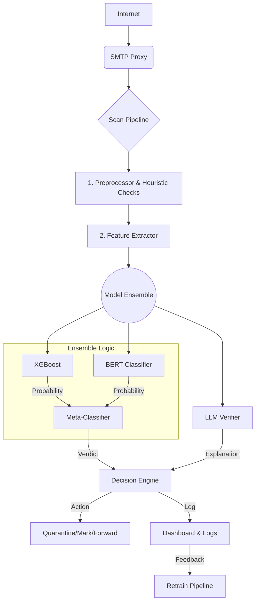

# 🛡️ Phishing Email Detector
## GROUP AT06


Dự án Xây dựng Hệ thống Phát hiện Email Lừa đảo (Phishing) sử dụng phương pháp Ensemble Machine Learning kết hợp Mô hình Ngôn ngữ Lớn (LLM) để tăng cường độ chính xác và khả năng giải thích (Explainability).

---

## 🚀 Tính năng chính

-   **Quét email thời gian thực**: Tích hợp dưới dạng SMTP Proxy để phân tích email ngay khi chúng đến.
-   **Kiểm tra kỹ thuật đa lớp**: Tự động xác thực SPF, DKIM, DMARC và kiểm tra uy tín của URL/tên miền.
-   **Phân tích nội dung thông minh**: Sử dụng kiến trúc Ensemble kết hợp:
    -   **Classical ML (XGBoost)**: Dựa trên các đặc trưng được thiết kế thủ công (handcrafted features) để phát hiện nhanh.
    -   **Transformer (BERT)**: Phân tích ngữ nghĩa sâu của tiêu đề và nội dung email.
    -   **LLM Verifier**: Cung cấp giải thích bằng ngôn ngữ tự nhiên về lý do một email bị gắn cờ.
-   **Dashboard trực quan**: Giao diện quản trị để xem lại các email bị gắn cờ, xem giải thích và cung cấp phản hồi.
-   **Vòng lặp Phản hồi (Feedback Loop)**: Admin có thể đánh dấu lại các email (False Positive/Negative) để tái huấn luyện và cải thiện mô hình theo thời gian.

## 🏛️ Sơ đồ kiến trúc tổng quan



## 💻 Công nghệ sử dụng

-   **Ngôn ngữ**: Python 3.10+
-   **Backend & API**: FastAPI, Uvicorn
-   **SMTP Proxy**: Aiosmtpd
-   **Machine Learning**: Scikit-learn, XGBoost
-   **Deep Learning**: PyTorch, Hugging Face Transformers
-   **Data Processing**: Pandas, NumPy
-   **Deployment**: Docker, Docker Compose (dự kiến)

## 🛠️ Hướng dẫn cài đặt và sử dụng

1.  **Clone repository về máy:**
    ```bash
    git clone https://github.com/OgaTatsumii/phishing-detector.git
    cd phishing-detector
    ```

2.  **Tạo và kích hoạt môi trường ảo:**
    ```bash
    # Trên Windows (PowerShell)
    python -m venv .venv
    .\.venv\Scripts\Activate.ps1

    # Trên macOS/Linux
    python3 -m venv .venv
    source .venv/bin/activate
    ```

3.  **Cài đặt các thư viện cần thiết:**
    ```bash
    pip install -r requirements.txt
    ```

4.  **Chạy Jupyter Notebook để khám phá dữ liệu:**
    ```bash
    jupyter notebook
    ```
    Mở file `01_data_exploration_and_preprocessing.ipynb` để bắt đầu.

## 📂 Cấu trúc thư mục (dự kiến)

```
phishing-detector/
├── .venv/                  # Thư mục môi trường ảo
├── data/                   # Chứa các bộ dữ liệu (không push lên Git)
├── models/                 # Chứa các model đã được huấn luyện
├── notebooks/              # Chứa các file Jupyter Notebook
│   └── 01_data_exploration_and_preprocessing.ipynb
├── src/                    # Mã nguồn chính của ứng dụng
│   ├── api/                # Mã nguồn cho API
│   ├── ml/                 # Mã nguồn cho pipeline ML
│   └── proxy/              # Mã nguồn cho SMTP proxy
├── .gitignore
├── README.md
└── requirements.txt
```

## 🗺️ Lộ trình phát triển (Roadmap)

-   [x] Thiết lập dự án và môi trường
-   [ ] **Tuần 1-2**: Hoàn thành Preprocessor và thu thập, chuẩn hóa dữ liệu
-   [ ] **Tuần 3-4**: Xây dựng baseline model (XGBoost) và các Heuristic checks
-   [ ] **Tuần 5-7**: Fine-tune mô hình Transformer (BERT)
-   [ ] **Tuần 8-9**: Tích hợp LLM để tạo giải thích
-   [ ] **Tuần 10-11**: Xây dựng SMTP Proxy, API và Dashboard cơ bản
-   [ ] **Tuần 12**: Kiểm thử, hoàn thiện và viết báo cáo

## 👥 Tác giả

-   [OgaTatsumii](https://github.com/OgaTatsumii)

-   [VAP](https://github.com/Anhphung14)


